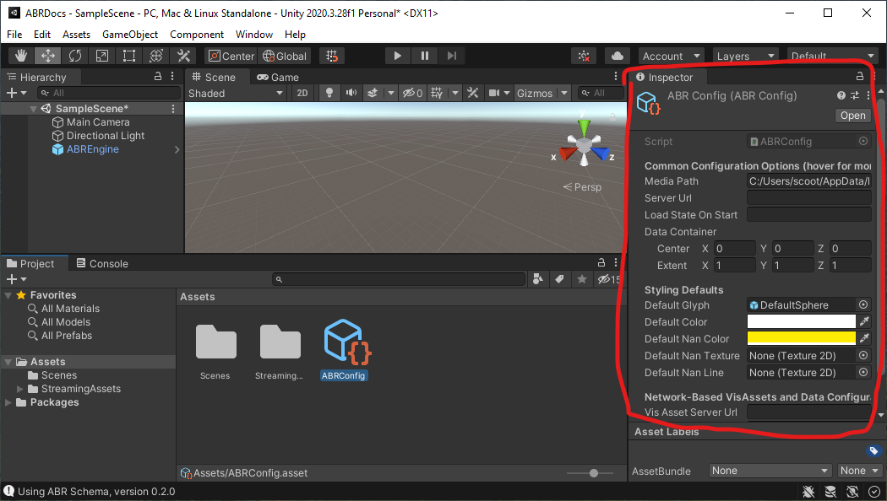
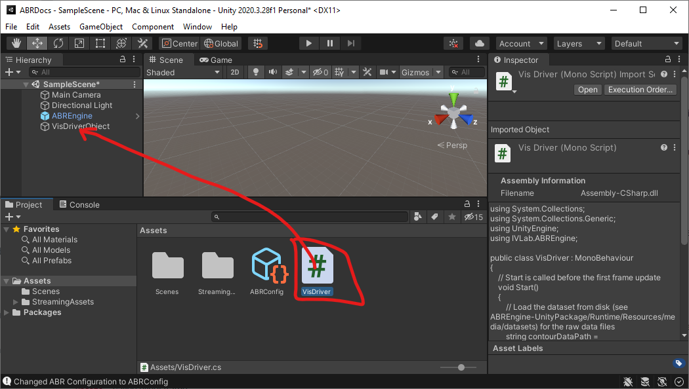

# Creating your first C# ABR Visualization

Before you begin, make sure you have Unity open and have followed the [ABR install instructions](install.md).

During this tutorial, we'll make a visualization of some 3D surface data like this:


## Part 0: Getting used to C# Syntax and the ABREngine

Even if you've done lots of C# Scripting previously, this part is still worth reading because it's important to be aware of a few design patterns the ABREngine uses.

### Tip 1: Use of `.Instance`

Like other object-oriented programming languages, C# uses classes, and you
access the member variables and functions of those classes with a `.`  So, in
the line above, @IVLab.ABREngine.ABREngine is a class (one of the most important in ABR), and
`.Instance` refers to a member variable inside the ABREngine class.  Whenever
you see a member variable named `Instance`, it's a good bet that this code is
using a [Singleton Design Pattern](https://www.c-sharpcorner.com/UploadFile/8911c4/singleton-design-pattern-in-C-Sharp/).  In short, this means it is a class that is
used sort of like a global variable, where the code enforces that only one
instance of this class can ever exist within the program.  In Unity programming,
you will see this used a lot for classes that are "in charge" of coordinating or
sharing important resources across the whole program, so often these will be
named "Engine" or "Manager" or something similar.  It's a good practice to make
such classes "singletons" when your code assumes you will never have more than
one "engine" or "manager".  The convention is that you can refer to this single
instance of the engine or manager class from anywhere in your program by simply
writing `Classname.Instance` -- in this case, `ABREngine.Instance`.

### Tip 2: C# Properties

Since `ABREngine.Instance` refers to the single instance of the ABREngine class
that exists in our program, anything that comes after this must be a member
variable, property, or function of the ABREngine class.  If you go to the
ABREngine documentation and scroll down a bit, you'll find VisAssets listed
under the "Properties" section. In C#, [Properties](https://docs.microsoft.com/en-us/dotnet/csharp/programming-guide/classes-and-structs/properties) are used like getter/setting
methods in many other languages - they just provide access to get and/or set data
stored internally in the class.

### Tip 3: Generics with <> Notation

Many ABREngine methods have a generic type parameter in angle brackets, for example `ABREngine.Instance.VisAssets.LoadVisAsset<ColormapVisAsset>(new Guid("5a761a72-8bcb-11ea-9265-005056bae6d8"))` has a type parameter `ColormapVisAsset`.

The method declaration for the generic method @IVLab.ABREngine.ABREngine.LoadVisAsset might look something like:

```cs
public class ABREngine
{
    public T LoadVisAsset<T>(Guid visAssetID) { ... }
}
```

Here, the compiler knows that wherever it sees a `T` inside this function it
should replace it with whatever class name you give it when you call the
function.  So, when we write `LoadVisAsset<ColormapVisAsset>(...)` it's like
calling a `ColormapVisAsset`-specific version of the `LoadVisAsset` function.  It is
good to have this syntax in mind when programming with Unity because some of the
most frequently used function in Unity, like @UnityEngine.GameObject.GetComponent use
the same approach.


## Part 1: Creating the ABREngine GameObject and configuration

Every ABR visualization needs to have the ABREngine GameObject and configuration correctly set up.

In the Unity Editor "Project" tab, search for ABREngine "In Packages". Then, drag-and-drop the ABREngine prefab (blue cube icon) into the Hierarchy.


If you click on the ABREngine GameObject you just created, you'll notice an error message in on the right Inspector panel:


To fix this, we need to create an ABR Configuration. In the Project tab, go to your Assets folder. Then, right/two-finger -click anywhere in the empty space and select *Create > ABR > ABR Configuration*.


You may leave it named "ABRConfig". Inspect the ABRConfig object you just created to see what configuration options are available to you - but for now, we can leave these all at their defaults.


Observe that now, when you click on the "ABREngine" GameObject, the ABRConfig you just created shows up under "Choose ABR Configuration".


Save your scene by pressing Ctrl+S or Cmd+S or navigating to *File > Save*.


## Part 2: Creating a C# Script to drive your visualization

Some ABR visualizations use the ABR design interface, but in this tutorial we
will solely focus on making a visualization with C# code. We will have a single
script, "VisDriver.cs", that creates our visualization by creating ABR [key
data](key-data.md), [VisAssets](visassets.md) and telling ABR to render these
with [data impressions](data-impressions.md).

First, let's create a new Empty GameObject. In the Hierarchy, right/two-finger click anywhere in the open space and select *Create Empty*. Call this GameObject "VisDriverObject".


Now, create a new C# Script. In the Project tab, right/two-finger click anywhere in the open space an select *Create > C# Script". Name it "VisDriver".


Lastly, drag and drop this script onto the "VisDriverObject" GameObject you created earlier.


To edit the script, right/two-finger click the "VisDriver" script in the Project
tab and click "Open C# Project". Before doing this, ensure that your
[external script editor](https://learn.unity.com/tutorial/set-your-default-script-editor-ide)
is set up correctly, and that under "Generate .csproj files for:", "Embedded
Packages", "Local Packages", and "Local Tarball" are all checked.


## Part 3: Making a visualization

After clicking "Open C# Project" and navigating to VisDriver.cs in your code
editor, you should see that Unity has populated a new
[MonoBehaviour Class](https://docs.unity3d.com/Manual/class-MonoBehaviour.html) named `VisDriver`.

This part will walk you through the steps to create your first script-based visualization with ABR, which will end up looking like this:

### Importing the ABREngine

Add the following code to the header of the VisDriver file under `using UnityEngine`:

```cs
using IVLab.ABREngine;
```

This line of code makes the power of ABR available to you in this script.


### 1. Import some data

For simplicity, we're going to put all our visualization code in the `Start()` method, so you can delete the `Update()` method at this point.

Now, in the `Start()` method, we'll begin by importing some example data that's available for you to use in ABR. Copy and past the following code into your `Start()` method:

```cs
// 1. Load the dataset from disk (see ABREngine-UnityPackage/Runtime/Resources/media/datasets) for the raw data files
string contourDataPath = "Demo/Wavelet/KeyData/Contour";
KeyData contour = ABREngine.Instance.Data.LoadData(contourDataPath);
```

### 2. Putting it together in a data impression

Data impressions are the "layers" of the visualization. So, to combine data and VisAssets, we need to create a data impression and assign data to it:

```cs
// 2. Create surface data impression and assign key data
SimpleSurfaceDataImpression surf = new SimpleSurfaceDataImpression();
surf.keyData = contour;
```

### 3. Registering and rendering

Finally, to get our data to show up at all, we need to first `Register` the data impression we created with the ABREngine. This only needs to be done once right after the Data Impression is created.

```cs
// 3.a. Register the data impression so ABR knows about it
ABREngine.Instance.RegisterDataImpression(surf);
```

Then `Render()` the visualization. This needs to be done every time something changes, such as a colormap or data value.

```cs
// 3.b. Render the visualization
ABREngine.Instance.Render();
```

At this point, check your work. Go back to Unity and press the "Play" button triangle in the top toolbar. If everything is working correctly, you should see a small "blob-like" visualization in the center of your game view - this is the "Contour" data you imported in Step 1!


### 4. Import a colormap VisAsset

To add some color to the visualization, we'll need a colormap. Add the following code to your `Start()` method. Copy/paste this code right after the existing Step 1 code:

```cs
// 1.c. Import a Colormap VisAsset
ColormapVisAsset cmap = ABREngine.Instance.VisAssets.LoadVisAsset<ColormapVisAsset>(new System.Guid("5a761a72-8bcb-11ea-9265-005056bae6d8"));
```


### 5. Assign colormap and color variable to data impression

The data and the colormap visasset are linked together in the `surf` data impression created in Step 2. Let's add some more code between steps 2 and 3:

```cs
// 2.b. Assign colormap to data impression
surf.colormap = cmap;

// 2.c. Assign color variable to data impression
surf.colorVariable = contour.GetScalarVariable("XAxis");
```

This code will first link the colormap you imported in Step 4 to the data impression, then it will look in the "Contour" key data object and find a scalar variable "XAxis". See [Key Data](key-data.md) for more information on key data.

At this point, go back to Unity and try running the visualization again. After adjusting the camera to be closer to the center of the scene (camera position = (0, 0, -2)), your game view should look like this:
