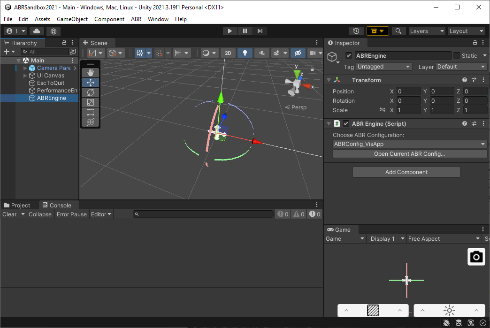
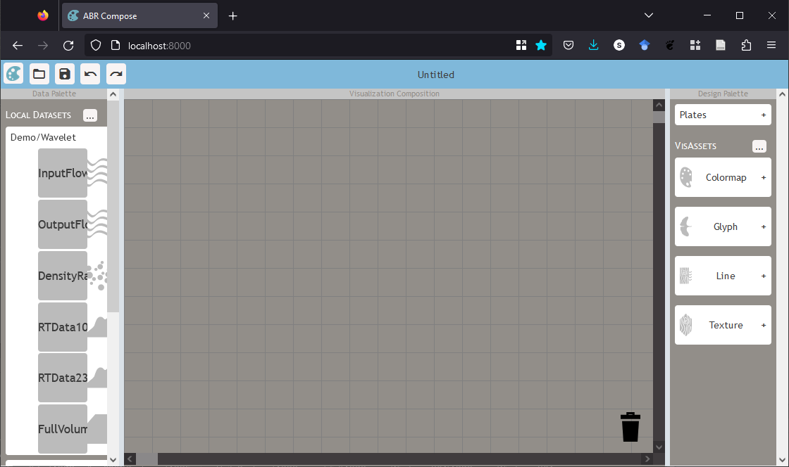

# ABR Vis App

This example is a pre-built app that you can use to design visualizations with
the ABR Compose design interface. Follow along with this tutorial to get started
building your first visualization.

## Part 1: Setup

Before you begin, make sure you have [installed ABR and all its dependencies](install.md).

First, import the ABR Vis App sample. You can do this by opening the package
manager and navigating to the ABR package, twirling down "Samples", and clicking
"Import" for the "ABR Vis App" sample.

Once the sample has loaded, open the "Main" scene in the "Scenes" folder of "ABR
Vis App". You should see a scene like the following:

Lastly, we need some data to visualize! In Unity, click *ABR > Copy Example Data
to Media Folder*. This will make some example data available to the ABR design
interface and the ABR Engine!

## Part 2: Running the server

To design visualizations with the ABR design interface, you'll need to start the
ABR server. In a perfect world, you'll be able to launch it directly from the
editor, but that may not work so we will provide two sets ,questionnaire!of instructions for
this part.

### Option 1: Start ABR Server from Unity

In the Unity editor, click *ABR > Server > Start Server*. Wait a few moments
while the Python window pops up and logs some information - this window is the
ABR server so don't close it!

If there were errors in the Unity console or the server doesn't start for any
reason, you'll need to try Option 2.

### Option 2: Start ABR Server with Python

There's a chance we may have not compiled the ABR server for your platform yet,
so you'll need to use Python to run the server in the meantime.

Information about how to run the Python server can be found in the [ABR Server
Readme](../abr-server.md)

After you've started the server, visit http://localhost:8000 in a
web browser. You should now see the ABR design interface:

## Next steps

At this point, you're ready to get started designing a visualization! Your next
step is to follow along with the @creating-design-interface-vis.md tutorial.