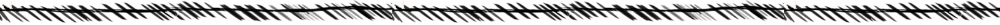
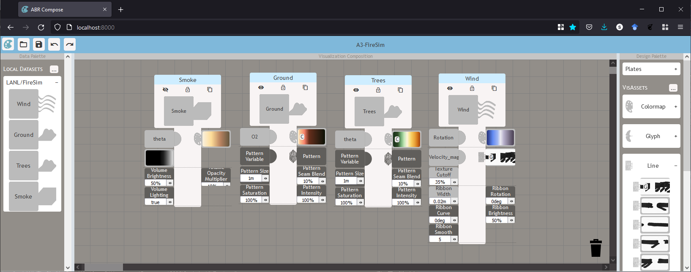

# Artifact-Based Rendering Engine

The purpose of the Artifact-Based Rendering Engine (ABR Engine) is to provide artists with tools and techniques to create high-fidelity visualizations of multivariate spatiotemporal data using their own traditional-media creations, such as:

Colormaps inspired by nature

Sketched / inked lines

Textures gathered from the real world

Hand-sculpted clay glyphs

With ABR as a tool in their studio, artists have created images like the following:

Gulf of Mexico biogeochemistry visualization created by artist Stephanie Zeller

Ocean currents underneath the Filchner-Ronne Ice Shelf in the antarctic by artist Francesca Samsel

The ABR Engine was created and is maintained by the [Sculpting Visualizations Collective](https://sculpting-vis.org).

## Getting Started with ABR

ABR has two modes which have similar functionality. GUI mode is for rapidly
creating visualizations with no programming involved. C# mode is useful for
creating programmatic visualizations, and this mode includes newer and
experimental features of ABR that haven't yet been incorporated to the GUI mode.
Before getting into specifics of either of these modes, it is important to
understand a few concepts about ABR. Give each of these core concepts a read
through before diving into creating with ABR:

[!include[core-concepts.md](core-concepts.md)]

### Getting Started with ABR C#

Please see [Creating your first C# ABR Visualization](creating-cs-abr-vis.md).

### Getting Started with ABR GUI

ABR design interface for a visualization of wildfire data.

[more to come on this section]