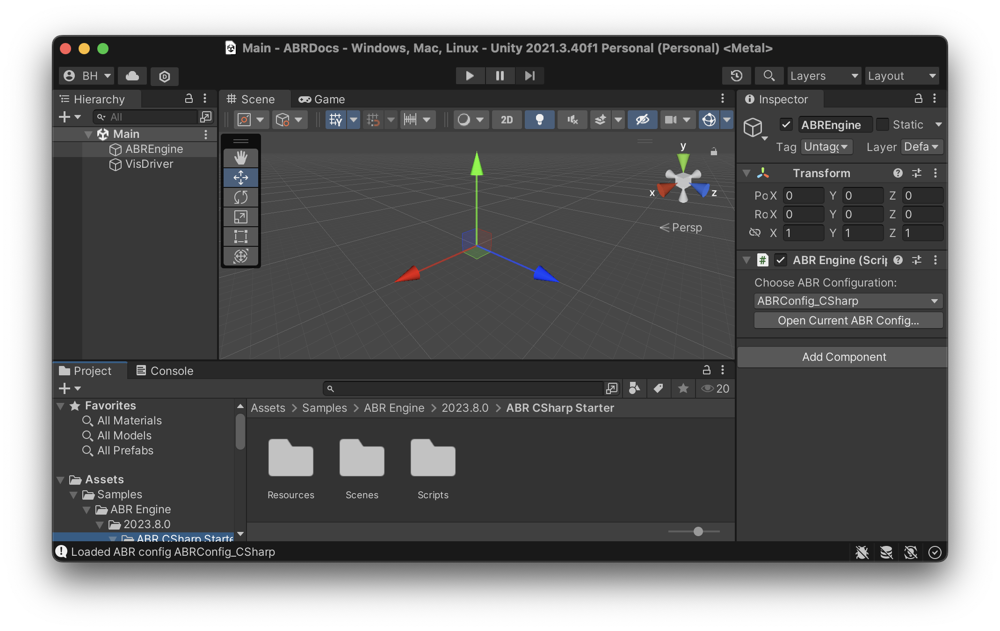

# Creating your first C# ABR Visualization

Before you begin, make sure you have Unity open and have followed the [ABR install instructions](../install.md).

During this tutorial, we'll make a visualization of some 3D surface data like this:


## Part 0: Getting used to C# Syntax and the ABREngine

Even if you've done lots of C# Scripting previously, this part is still worth reading because it's important to be aware of a few design patterns the ABREngine uses.

### Tip 1: Use of `.Instance`

Like other object-oriented programming languages, C# uses classes, and you
access the member variables and functions of those classes with a `.`  So, in
the line above, @IVLab.ABREngine.ABREngine is a class (one of the most important in ABR), and
`.Instance` refers to a member variable inside the ABREngine class.  Whenever
you see a member variable named `Instance`, it's a good bet that this code is
using a [Singleton Design Pattern](https://www.c-sharpcorner.com/UploadFile/8911c4/singleton-design-pattern-in-C-Sharp/).  In short, this means it is a class that is
used sort of like a global variable, where the code enforces that only one
instance of this class can ever exist within the program.  In Unity programming,
you will see this used a lot for classes that are "in charge" of coordinating or
sharing important resources across the whole program, so often these will be
named "Engine" or "Manager" or something similar.  It's a good practice to make
such classes "singletons" when your code assumes you will never have more than
one "engine" or "manager".  The convention is that you can refer to this single
instance of the engine or manager class from anywhere in your program by simply
writing `Classname.Instance` -- in this case, `ABREngine.Instance`.

### Tip 2: C# Properties

Since `ABREngine.Instance` refers to the single instance of the ABREngine class
that exists in our program, anything that comes after this must be a member
variable, property, or function of the ABREngine class.  If you go to the
ABREngine documentation and scroll down a bit, you'll find VisAssets listed
under the "Properties" section. In C#, [Properties](https://docs.microsoft.com/en-us/dotnet/csharp/programming-guide/classes-and-structs/properties) are used like getter/setting
methods in many other languages - they just provide access to get and/or set data
stored internally in the class.

### Tip 3: Generics with <> Notation

Many ABREngine methods have a generic type parameter in angle brackets, for example `ABREngine.Instance.VisAssets.LoadVisAsset<ColormapVisAsset>(new Guid("5a761a72-8bcb-11ea-9265-005056bae6d8"))` has a type parameter `ColormapVisAsset`.

The method declaration for the generic method @IVLab.ABREngine.ABREngine.LoadVisAsset might look something like:

```cs
public class ABREngine
{
    public T LoadVisAsset<T>(Guid visAssetID) { ... }
}
```

Here, the compiler knows that wherever it sees a `T` inside this function it
should replace it with whatever class name you give it when you call the
function.  So, when we write `LoadVisAsset<ColormapVisAsset>(...)` it's like
calling a `ColormapVisAsset`-specific version of the `LoadVisAsset` function.  It is
good to have this syntax in mind when programming with Unity because some of the
most frequently used function in Unity, like @UnityEngine.GameObject.GetComponent use
the same approach.


## Part 1: Setup

### Part 1.1: Unity Setup

First, import the ABR C# sample. You can do this by opening the package
manager and navigating to the ABR package, twirling down "Samples", and clicking
"Import" for the "ABR CSharp Starter" sample.

Once the sample has loaded, open the "Main" scene in the "Scenes" folder. You
should see a scene like the following:



Further, we need some data to visualize! In Unity, click *ABR > Copy Example Data
to Media Folder*. This will make some example data available to the ABR design
interface and the ABR Engine! (if you have already done this in the
@abr-vis-app.md tutorial, you don't need to do it again.)


### Part 1.2: Scripting Setup

You will need a code editing environment to complete this tutorial. Please refer
to the @install.md instructions for information on how to set up C# scripting in
Unity with your preferred code editor.


## Part 2: Creating a C# Script to drive your visualization

Some ABR visualizations use the ABR design interface, but in this tutorial we
will solely focus on making a visualization with C# code. We will have a single
script, "VisDriver.cs", that creates our visualization by creating ABR [key
data](../concepts/key-data.md), [VisAssets](../concepts/visassets.md) and
telling ABR to render these with [data
impressions](../concepts/data-impressions.md).

In the starter template, we've already added the ABREngine GameObject, but if
you wanted to create one yourself, you can click *GameObject > ABR > ABREngine*.
Keep in mind there should only be *one* ABREngine GameObject in any scene.

In the starter template, we've already created the VisDriver.cs script, but if
you wanted to create another one, you can click *Assets > Create > C# Script*.

To edit the script, right/two-finger click the "VisDriver" script in the Project
tab (in the Scripts folder) and click "Open C# Project". 


## Part 3: Making a visualization

> [!NOTE]
> If you have not already done so, please take a glance at the
> @terminology-starter.md page to familiarize yourself with the technical terms
> that are used below.

After clicking "Open C# Project" and navigating to VisDriver.cs in your code
editor, you should see that Unity has populated a new
[MonoBehaviour Class](https://docs.unity3d.com/Manual/class-MonoBehaviour.html) named `VisDriver`.

This part will walk you through the steps to create your first script-based
visualization with ABR, which will end up looking like this:


In general, the process for creating an ABR visualization follows this process:
1. Import data using @IVLab.ABREngine.DataManager.LoadData(System.String)
2. Import VisAssets using [VisAssetManager.GetVisAsset](xref:IVLab.ABREngine.VisAssetManager#IVLab_ABREngine_VisAssetManager_GetVisAsset__1_System_Guid_)
3. Create a @IVLab.ABREngine.DataImpression to combine the data and visuals together (using [DataImpression.Create](xref:IVLab.ABREngine.DataImpression#IVLab_ABREngine_DataImpression_Create__1_System_String_System_Guid_System_Boolean_)).
4. Use
   [ABREngine.RegisterDataImpression](xref:IVLab.ABREngine.ABREngine#IVLab_ABREngine_ABREngine_RegisterDataImpression_IVLab_ABREngine_DataImpression_System_Boolean_) to add the impression to the engine.
5. Render the data and visuals to the screen using @IVLab.ABREngine.ABREngine.Render


### Importing the ABREngine

Before we add any ABR code, we need to add the following code to the header of
the VisDriver.cs file under `using UnityEngine`:

```cs
using IVLab.ABREngine;
```

This line of code makes the power of ABR available to you in this script.


### 1. Import some data

For simplicity, we're going to put all our visualization code in the `Start()`
method, so you can delete the `Update()` method at this point.

Now, in the `Start()` method, we'll begin by importing some example data that's
available for you to use in ABR. Copy and past the following code into your
`Start()` method:

```cs
// 1. Load the dataset from disk (see ABREngine-UnityPackage/Runtime/Resources/media/datasets) for the raw data files
// (this is the data that was loaded when you clicked *ABR > Copy Example Data to Media Folder* earlier!)
string contourDataPath = "Demo/Wavelet/KeyData/RTData230";
KeyData contour = ABREngine.Instance.Data.LoadData(contourDataPath);
```

### 2. Putting it together in a data impression

Data impressions are the "layers" of the visualization. So, to combine data and
VisAssets, we need to create a data impression and assign data to it:

```cs
// 2. Create surface data impression and assign key data
SimpleSurfaceDataImpression surf = DataImpression.Create<SimpleSurfaceDataImpression>("Contour Impression");
surf.keyData = contour;
```

### 3. Registering and rendering

Finally, to get our data to show up at all, we need to first `Register` the data impression we created with the ABREngine. This only needs to be done once right after the Data Impression is created.

```cs
// 3.a. Register the data impression so ABR knows about it
ABREngine.Instance.RegisterDataImpression(surf);
```

Then `Render()` the visualization. This needs to be done every time something changes, such as a colormap or data value.

```cs
// 3.b. Render the visualization
ABREngine.Instance.Render();
```

At this point, check your work. Go back to Unity and press the "Play" button
triangle in the top toolbar. If everything is working correctly, you should see
a gray/white blob-like visualization in the center of your game view - this is
the "RTData230" surface data you imported in Step 1!


### 4. Import a colormap VisAsset

To add some color to the visualization, we'll need a colormap. Add the following code to your `Start()` method. Copy/paste this code right after the existing Step 1 code:

```cs
// 1.b. Import a Colormap VisAsset
ColormapVisAsset cmap = ABREngine.Instance.VisAssets.LoadVisAsset<ColormapVisAsset>(new System.Guid("5a761a72-8bcb-11ea-9265-005056bae6d8"));
```


### 5. Assign colormap and color variable to data impression

The data and the colormap visasset are linked together in the `surf` data impression created in Step 2. Let's add some more code between steps 2 and 3:

```cs
// 2.b. Assign colormap to data impression
surf.colormap = cmap;

// 2.c. Assign color variable to data impression
surf.colorVariable = contour.GetScalarVariable("XAxis");
```

This code will first link the colormap you imported in Step 4 to the data impression, then it will look in the "Contour" key data object and find a scalar variable "XAxis". See [Key Data](../concepts/key-data.md) for more information on key data.

At this point, go back to Unity and try running the visualization again. Your
game view should now look like this:


> [!NOTE]
> You can see a completed version of the tutorial in the VisDriverTutorial.cs
> file in the same folder as the original VisDriver.cs file.


> [!TIP]
> You can use this script and example as a starting point anytime you make a C#
> visualization in ABR!

## Next Steps

Now that you're familiar with the basics of creating a C# Visualization with
ABR, check out the following resources for working with ABR in Unity:

- ABR Configuration
- Advanced Editor Usage
    - placing data impression groups in your scene (handling data and world space)
    - simultaneously using ABR COmpose and C# scripting
- Creating and loading datasets
- Interactivity
- Styling