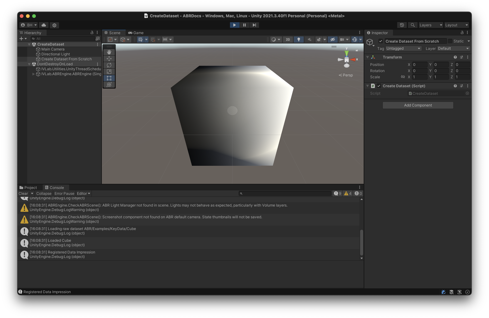
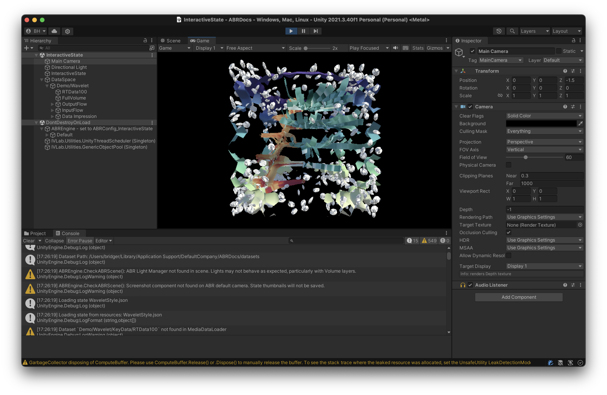
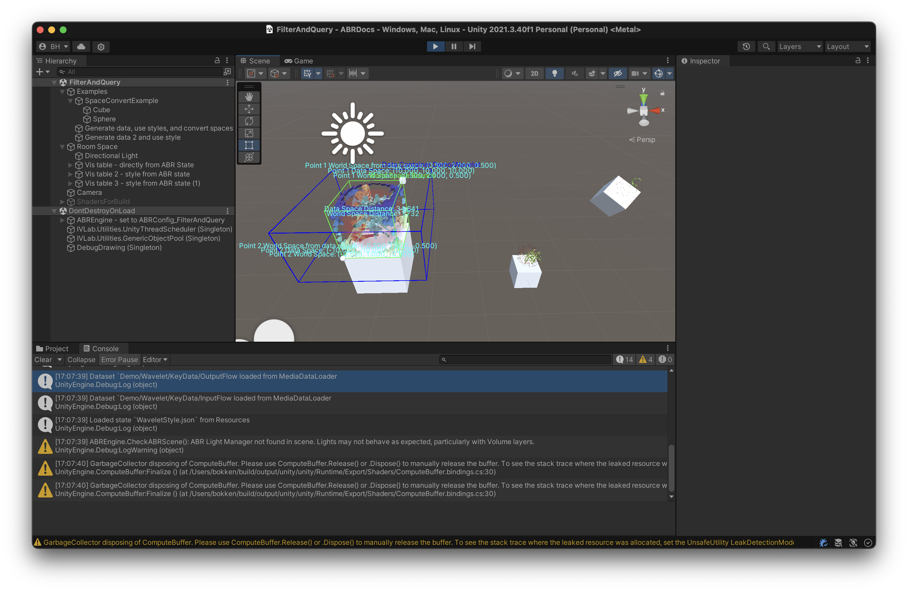
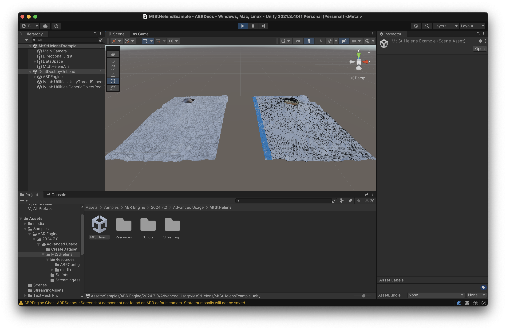

# Advanced usage of ABR and C#

This page shows many advanced usages of ABR and for integrating it into your
existing Unity projects.

- **Creating a dataset from scratch:** Introduces the basics of how datasets
  work in ABR by creating a cube.
- **Interactive State Modification:** Loads a state from JSON then modifies it
interactively.
- **Interactive Filtering and Querying:** Works through several key concepts,
  including data space vs. world space, filtering data, copying and linking
  styles between data impressions.
- **Culminating Example:** Interactive Visualization of Mount St. Helens.
  Demonstrates features like VisAsset Gradients, Data Containers, Data
  Impression Groups, Per-Index Visibility, and Interactivity.

## Creating a Dataset From Scratch

## Interactive State Modification

## Interactive Filtering and Querying

## Real Data Example

