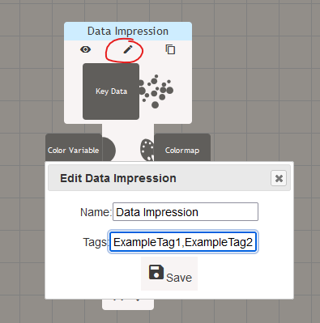

# Advanced usage of ABR and C#

This page shows many advanced usages of ABR and for integrating it into your
existing Unity projects.

- **Interactive Filtering and Querying:** Works through several key concepts,
  including data space vs. world space, filtering data, copying and linking
  styles between data impressions.
- **Creating a dataset from scratch:** Introduces the basics of how datasets
  work in ABR by creating a cube.
- **Interactive State Modification:** Loads a state from JSON then modifies it
interactively.
- **Culminating Example:** Interactive Visualization of Mount St. Helens.
  Demonstrates features like VisAsset Gradients, Data Containers, Data
  Impression Groups, Per-Index Visibility, and Interactivity.


## Interactive Filtering and Querying

If you're interested in using ABR for interactive data analysis, check out this example.


To start, make sure the ABREngine's configuration is set to
"ABRConfig_FilterAndQuery".

Now, let's walk through each part of the visualization and the features it
demonstrates.


In the scene, note the three data "tabletops" inside the "Room Space"
GameObject:
- **Vis Tabletop 1 -- directly from ABR JSON state.** This visualization comes directly from the WaveletStyle2.json file in the Resources folder of this sample. the @IVLab.ABREngine.ABRConfig is set up to load this state on startup; open the config by selecting the ABREngine GameObject and clicking "Open Current ABR Config..."
- **Vis Tabletop 2 -- new data, style from state.** This visualization uses styles from the JSON file loaded above but applies the styles to new data (generated by the the GenerateDataAndUseStyle.cs script). The visualization is also scaled down/contained within a smaller data container box.
- **Vis Tabletop 3 -- other new data, style from state.** This visualization uses styles from the WaveletStyle2.json file but applies the styles to new data (generated by the the GenerateDataAndUseStyle.cs script). The visualization is also scaled down/contained within a smaller data container box.


### Data Impression Groups

This sample scene relies heavily on Data Impression Groups. Before you go any further, please take a look at the Data Impression Groups section in the @data-impressions.md documentation.


Here, data impression groups make it possible to organize different groups of data in a multi-part visualization. We use them to contain the visualization inside specified container bounds, to move parts of the visualization around, and to measure objects in data space vs. room space.


### Data Space

Let's say we have a dataset that is 1000 km by 1000 km, as is common in large
geospatial datasets. What if we want to represent this dataset in VR but keep it
within room scale, say 2 meters wide? ABR's built-in data-space conversions,
and data container boxes help to achieve this goal.


Try selecting the GameObject *Vis Tabletop 1 > Tabletop Data Space > Demo/Wavelet*. When it's selected, you should see a white bounding box 2m x 2m x 1m. This is the bounds that the `Demo/Wavelet` dataset will be contained within when ABR is running! The bounding box is defined by the Data Impression Group and ABR Data Container components attached to the `Demo/Wavelet` GameObject. Remember, [Unity bounds extents](https://docs.unity3d.com/ScriptReference/Bounds-extents.html) are half of the Bounds size.


You will see similar Data Impression Groups in Vis Tabletops 2 and 3. In all cases, the data impression group bounding boxes should show up on top of the gray tabletops.


> [!TIP]
> Try deleting the ABR Data Container component on one of the Data Impression Groups and see what happens! When played, the visualization should revert to its default (uncontained) coordinates, which are about 20m wide.


### Space Conversion

ABR Data Impression Groups and Data Containers also enable us to convert between coordinate spaces. Check out the GameObject *Examples > SpaceConvertExample* - this shows details of converting between data space and world space in Vis Tabletop 1.

In short, as long as you have access to the Data Impression and Data Impression Group, you can use code like the following to convert between spaces (excerpt from ABRSpaceConvertExample.cs in the Scripts folder of that sample):

```cs
Vector3 measurePoint1 = Vector3.zero;
Vector3 measurePoint2 = Vector3.one;

DataImpression impression = ABREngine.Instance.GetDataImpression("Demo/Wavelet/KeyData/RTData100");
DataImpressionGroup group = ABREngine.Instance.GetGroupFromImpression(impression);

// convert to data space
Vector3 point1DataSpace = group.WorldSpacePointToDataSpace(measurePoint1.position);
Vector3 point2DataSpace = group.WorldSpacePointToDataSpace(measurePoint2.position);

// check conversion - point1WorldSpace should equal measurePoint1
Vector3 point1WorldSpace = group.DataSpacePointToWorldSpace(point1DataSpace);
Vector3 point2WorldSpace = group.DataSpacePointToWorldSpace(point2DataSpace);
```

You can also convert vectors with the methods labeled `...Vector...` instead of `...Point...`.


### Data Impression Styles


What if we want to apply the style (i.e., color, glyph shape, texture) from one data impression to another? What if we want that connection to persist over time?

Enter Styles.

In the C# API, data impressions can be simply cloned, they can be cloned with style only (copy everything but the data, or they can be cloned with a linked style that updates every time the source impression's style is changed).

```cs
// Define a data impression and set some styling / data
SimpleSurfaceDataImpression surf = DataImpression.Create<SimpleSurfaceDataImpression>("example surface");
surf.keyData = ABREngine.Instance.GetKeyData("Demo/Wavelet/KeyData/RTData100");
surf.colormap = ABREngine.Instance.GetVisAsset(new System.Guid("5a761a72-8bcb-11ea-9265-005056bae6d8"));
surf.colorVariable = surf.keyData.GetScalarVar("XAxis");


// Simply clone the data impression
SimpleSurfaceDataImpression surfClone = surf.Clone();

// Clone the data impression with only its style
SimpleSurfaceDataImpression surfStyleClone = surf.CloneStyle();

// Clone the data impression with only its style, and link the clone so it gets updated every time the original `surf` gets updated
SimpleSurfaceDataImpression surfStyleClone = surf.CloneStyleLinked();
```


You can also copy and link styles from other existing data impressions to an existing data impression:

```cs

SimpleSurfaceDataImpression sourceSurf = ...;
SimpleSurfaceDataImpression surfStyleCopy = ...;
SimpleSurfaceDataImpression surfStyleLink = ...;

surfStyleCopy.CopyStyleFrom(sourceSurf);
surfStyleLink.LinkStyleFrom(sourceSurf);
```


#### Defining styles in the ABR Design UI

One of the most powerful combinations is to use the ABR Compose UI to define styles, then build interactive Unity visualizations around those styles. The easiest way to do this currently is to use "tags". These are general-purpose strings attached to every Data Impression that you can specify arbitrary data to. For example, you can define a data impression for "Highlighted Points" and "Normal Points", then use these data impressions as styles in an interactive Unity application that selects and highlights points.

To edit a data impression's tags in the UI, click the edit pencil and type some text in the "Tags" field. You can use multiple tags, separated by commas.




In C#, you can access a data impression's tags:

```cs
string tag = "ExampleTag1";
List<DataImpression> tagged = ABREngine.Instance.GetDataImpressionsWithTag(tag);
```

Alternatively, you can get a data impression by its name :

```cs
string name = "Test Data Impression";

// lambda (arrow) function to select the first data impression matching the criteria `di.name == name`
DataImpression impressionWithName = ABREngine.Instance.GetDataImpression(di => di.name == name);
```


## Creating a Dataset From Scratch


## Interactive State Modification


## Real Data Example

